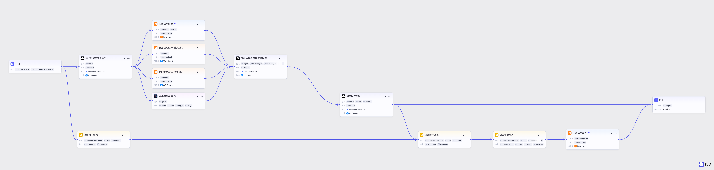
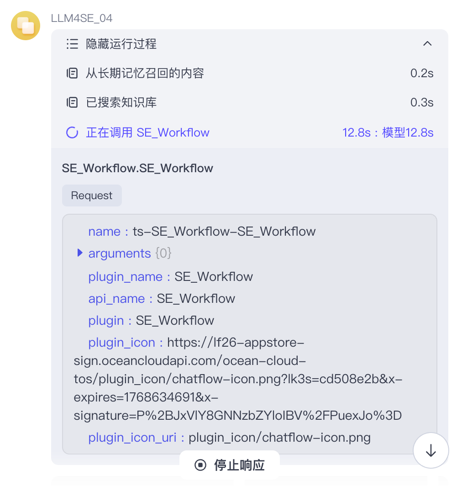
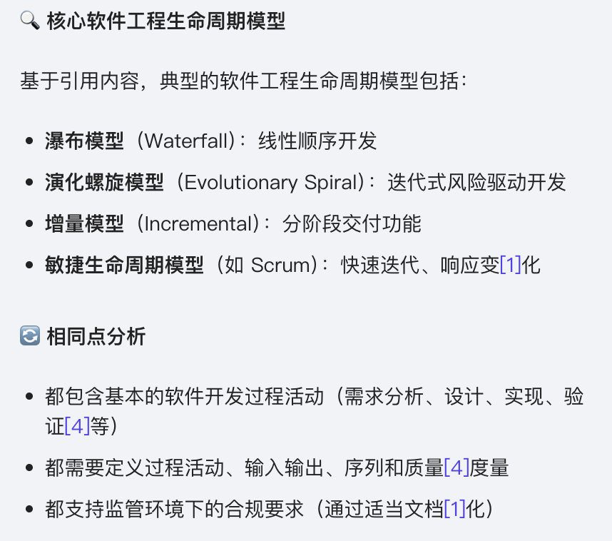

# LLM4SE_04 软件工程智能体

本项目为LLM4SE课程第四次作业**软件工程智能体**的报告。
GitHub公开仓库地址：https://github.com/1-211250009/LLM4SE_04

## 提交产物

Coze商店发布链接：

https://www.coze.cn/store/agent/7584378891201429519?bot_id=true

智能体流程图：

如图片模糊或太小，导致看不清内容，请查看 [SE_Workflow.svg](image/README/SE_Workflow.svg) 矢量图文件。

DSL文件：

DSL 文件位于 [artifacts/Chatflow-SE_Workflow](artifacts/Chatflow-SE_Workflow) 目录，或通过解压缩 [artifacts/Chatflow-SE_Workflow.zip](artifacts/Chatflow-SE_Workflow.zip) 文件得到。

## 设计说明

此部分详细阐述智能体工作流的设计思路和特点。

### 语义理解与输入重写

接收用户输入后，首先通过LLM节点进行语义理解和输入重写，将用户的原始问题扩展为结构化的学术查询，补充理论背景、技术细节和引用规范，提升后续检索的精准度。

技术选型：提示词方法，DeepSeek-V3模型。

### 知识库RAG

构建软件工程论文知识库（SE Papers），存储软件工程领域的经典学术论文、教材内容和行业标准，为智能体提供权威知识支撑。采用双路检索方法，分别基于用户原始输入和语义重写后的查询进行检索，提升召回率。由于软件工程论文具有**强结构 + 强术语特征**，仅使用语义检索或全文检索都存在系统性缺陷，因此本智能体采用 **“混合检索”** 作为基础检索策略，以兼顾语义理解能力与工程术语精确匹配能力。

技术选型：混合检索策略（向量检索+关键词检索），启用重排（Rerank）和查询重写（Rewrite）功能，设置相似度阈值0.5，返回Top-5结果。

### Web搜索

作为知识库RAG的补充信息源，通过Web搜索获取实时网络信息，弥补知识库在时效性和覆盖范围上的不足。

技术选型：Coze官方插件「联网问答」。

### 长期记忆管理

在用户对话中，智能体以用户透明的方式构建对话记忆。通过 `创建用户消息`和 `创建助手消息`节点管理对话历史，支持多轮对话的上下文传递，并在对话结束后将完整的问答历史写入长期记忆库。同时，在知识检索过程中检索长期记忆库，结合历史上下文提供更连贯的回答。

技术选型：Coze长期记忆库，通过 `长期记忆检索`和 `长期记忆写入`节点实现读写操作。

### 多源信息融合与证据仲裁

整合四个信息来源：长期记忆检索结果、双路知识库检索结果、Web搜索结果。通过 `证据仲裁与有效信息提炼`节点，按学术价值优先、可信度分级、信息密度等标准筛选高质量证据，排除冗余和低质量内容。

技术选型：DeepSeek-V3模型，证据交叉验证，结构化提取。

## 效果展示

